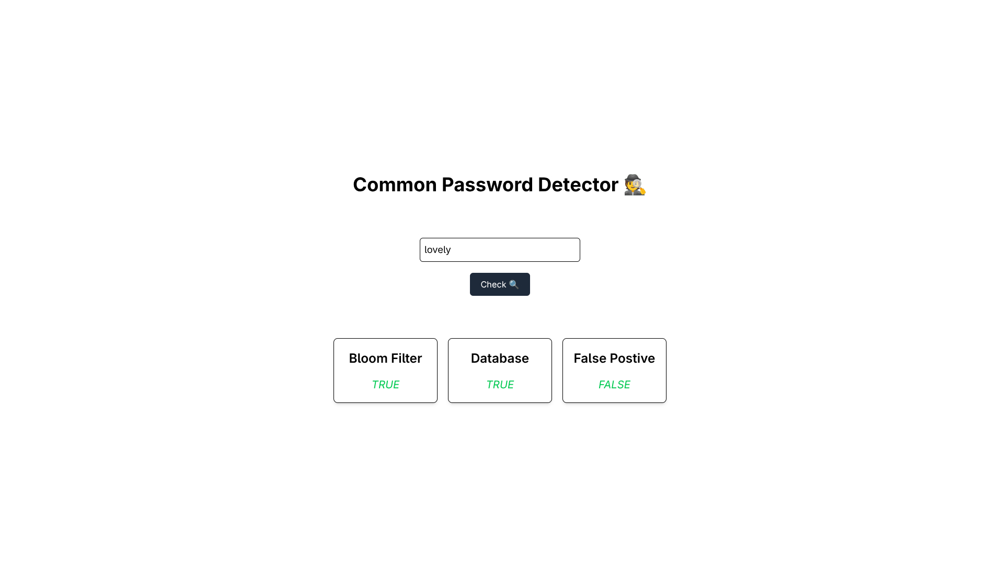

# Common Password Detector (Redis Bloom Filters)



## Setup

### Create Database

> use any popular db client (ui), it makes the setup process easy

1. Create database named "bloom_filters"
2. Create table named "passwords"
3. Import csv in /api/data folder

### Setup Redis Bloom Filters

0. Get inside the **bf-api** continer

```bash
docker exec -it bf-api sh
```

1. Create Bloom Filter

```bash
npm run filter:create
```

2. Populate Filter

```bash
npm run filter:populate # after completion press CTRL+C (cause stuck), idk why this is happening (i am too busy with business logic) I'll look into it
```

## Run

Run the compose up command inside the root directory

```bash
docker compose up
```

## Important

1. Volumes are setup for hot reload in compose if you want to change anything
2. These are not optimal (not for production) Dockerfiles or compose configs
3. I know it can be further improved, but hey it was just a tiny project for me to see how to implement bloom filter using redis
